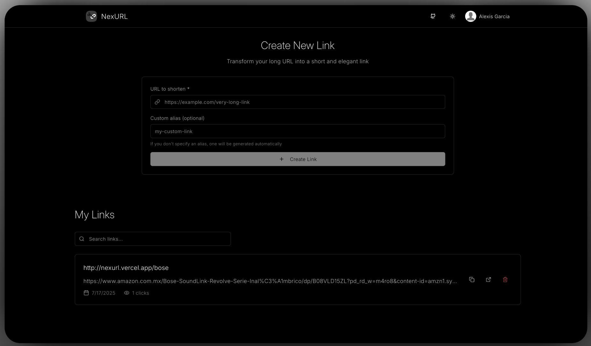

<div align="center">
  
  
  # Nex URL - Professional URL Shortener

  Transform long URLs into short and elegant links. Track clicks, analyze audience and manage your links professionally.
</div>

## 🚀 Features

- **URL Shortening**: Convert long URLs into short, shareable links
- **Custom Aliases**: Create personalized short links with custom aliases
- **Click Analytics**: Track clicks and analyze your audience
- **User Authentication**: Secure user accounts with Better Auth
- **Dashboard**: Manage all your links in one place
- **Responsive Design**: Works perfectly on desktop and mobile
- **Dark/Light Theme**: Toggle between themes for optimal viewing
- **Real-time Updates**: Instant feedback and updates
- **Export Data**: Download your links data as JSON

## 🛠️ Tech Stack

- **Framework**: [Next.js 15](https://nextjs.org/) with App Router
- **Language**: TypeScript
- **Styling**: Tailwind CSS 4
- **Authentication**: [Better Auth](https://better-auth.com/)
- **Database**: Turso (SQLite) with [Drizzle ORM](https://orm.drizzle.team/)
- **Animations**: Framer Motion
- **Icons**: Lucide React
- **Notifications**: Sonner
- **Deployment**: Vercel

## 📋 Prerequisites

Before you begin, ensure you have:

- Node.js 18+ installed
- npm, yarn, pnpm, or bun package manager
- A Turso database account (for production)

## 🚀 Getting Started

### 1. Clone the repository

```bash
git clone https://github.com/yourusername/nex-url.git
cd nex-url
```

### 2. Install dependencies

```bash
npm install
# or
yarn install
# or
pnpm install
# or
bun install
```

### 3. Environment Setup

Create a `.env.local` file in the root directory:

```env
# Database Configuration (Turso)
TURSO_CONNECTION_URL=your_turso_database_url
TURSO_AUTH_TOKEN=your_turso_auth_token

# Authentication
BETTER_AUTH_SECRET=your_random_secret_key
BETTER_AUTH_URL=http://localhost:3000
GOOGLE_CLIENT_ID=your_google_client_id
GOOGLE_CLIENT_SECRET=your_github_client_secret
GITHUB_CLIENT_ID=your_github_client_id
GITHUB_CLIENT_SECRET=your_github_client_secret
```

### 4. Database Setup

Run database migrations:

```bash
npm run db:generate
npm run db:migrate
```

### 5. Start the development server

```bash
npm run dev
# or
yarn dev
# or
pnpm dev
# or
bun dev
```

Open [http://localhost:3000](http://localhost:3000) in your browser to see the application.

## 📂 Project Structure

```
nex-url/
├── src/
│   ├── app/                 # Next.js App Router pages
│   │   ├── api/            # API routes
│   │   ├── dashboard/      # Dashboard pages
│   │   ├── settings/       # Settings pages
│   │   └── layout.tsx      # Root layout
│   ├── components/         # React components
│   │   ├── auth/          # Authentication components
│   │   ├── dashboard/     # Dashboard components
│   │   ├── landing/       # Landing page components
│   │   ├── layout/        # Layout components
│   │   ├── providers/     # Context providers
│   │   ├── setting/       # Settings components
│   │   └── ui/            # Reusable UI components
│   ├── db/                # Database configuration
│   │   ├── index.ts       # Database connection
│   │   └── schema.ts      # Database schema
│   ├── hooks/             # Custom React hooks
│   ├── lib/               # Utility functions
│   ├── server/            # Server-side logic
│   ├── styles/            # Global styles
│   └── types/             # TypeScript type definitions
├── public/                # Static assets
├── drizzle.config.ts      # Drizzle ORM configuration
└── package.json           # Dependencies and scripts
```

## 📝 License

This project is licensed under the MIT License - see the [LICENSE](LICENSE) file for details.

---
 
<p align="center">
  Built with ❤️ by <a href="https://github.com/alexisgxrcia">Alexis García</a>
</p>