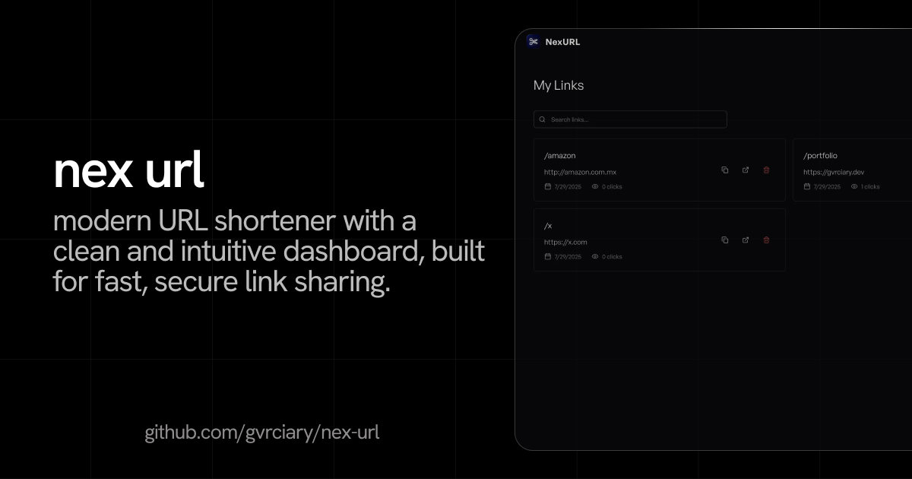

## `nex url` - Professional URL Shortener

<div align="center">



</div>

## Whats is nex url?

Transform long URLs into short and elegant links. Track clicks, analyze audience and manage your links professionally.

### Features

- **URL Shortening**: Convert long URLs into short, shareable links
- **Custom Aliases**: Create personalized short links with custom aliases
- **Dashboard**: Manage all your links in one place
- **Responsive Design**: Works perfectly on desktop and mobile
- **Dark/Light Theme**: Toggle between themes for optimal viewing
- **Real-time Updates**: Instant feedback and updates
- **Export Data**: Download your links data as JSON

## Installation

1. **Clone the repository**
   ```bash
   git clone https://github.com/gvrciary/nex-url.git
   cd nex-url
   ```

2. **Install dependencies**
   ```bash
   npm install
   ```

3. **Environment Setup**

  Create a `.env.local` file in the root directory:

  ```env
  # Database Configuration (Turso)
  TURSO_CONNECTION_URL=your_turso_database_url
  TURSO_AUTH_TOKEN=your_turso_auth_token
  
  # Authentication
  BETTER_AUTH_SECRET=your_random_secret_key
  BETTER_AUTH_URL=http://localhost:3000
  GOOGLE_CLIENT_ID=your_google_client_id
  GOOGLE_CLIENT_SECRET=your_github_client_secret
  GITHUB_CLIENT_ID=your_github_client_id
  GITHUB_CLIENT_SECRET=your_github_client_secret
  ```

4. **Database Setup**
  Run database migrations:
  
  ```bash
  npm run db:generate
  npm run db:migrate
  ```
3. **Run in development mode**
  ```bash
  npm run dev
  ```

## License

[](LICENSE)